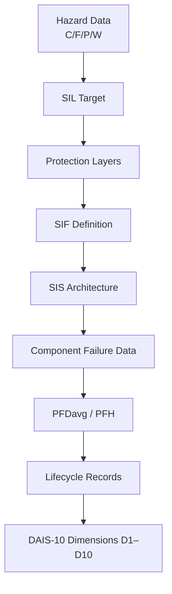

Functional Safety Interoperability Expansion
Date: January 19, 2026
Author: Usman Zafar
Scope: DAIS‑10 Interoperability | Functional Safety Integration | Risk Graph + SIS/SIF Architecture Mapping

1. Executive Summary
This update formalizes the DAIS‑10 ↔ Functional Safety Interoperability Bridge, enabling structured ingestion, normalization, and bidirectional mapping of functional safety data (IEC 61508 / IEC 61511) into the DAIS‑10 architecture.

The objective is not to modify or critique the safety system.
The objective is to establish a deterministic, lossless bridge between:

Functional Safety Data

DAIS‑10 Dimensions

Enterprise‑grade traceability and governance

This update introduces a canonical data model, dimension mapping, and interoperability rules.

2. Key Additions in This Update
2.1 Functional Safety Data Architecture Extracted
The repository now includes a structured interpretation of the following safety system components:

Risk Graph (C/F/P/W → SIL)

Protection Layers (Preventive/Mitigative)

SIS/SIF Architecture (Sensor → Logic → Final Element)

Reliability Metrics (λ, DC, SFF, HFT, MTTR, TI, PFDavg)

Lifecycle Model (13‑step IEC 61511 lifecycle)

Systematic Capability (SC1–SC4)

Prior Use Requirements

Standards References (IEC 61508, IEC 61511, NFPA 85, API 556, etc.)

These elements are now normalized into DAIS‑10‑compatible entities.

3. Canonical Entity Model Added
A new /models/safety/ directory now defines the following canonical entities:

3.1 Hazard Entity
Hazard ID

Description

Consequence Class (C1–C4)

Frequency Category (F1–F2)

Probability of Avoidance (P1–P2)

Probability of Unwanted Event (W1–W3)

Derived SIL Target

Linked Protection Layers

3.2 Protection Layer Entity
Layer ID

Type (Process, BPCS, Alarm, SIS, Mechanical, etc.)

Category (Preventive/Mitigative)

Risk Reduction Credit (if applicable)

Standards Reference

3.3 SIF Entity
SIF ID

Narrative

EUC Link

Safe State Definition

Demand Mode (Low/High/Continuous)

Target SIL

Architecture (1oo1, 1oo2, 2oo3, etc.)

Trip Points

Response Time

Proof Test Interval

Spurious Trip Tolerance

3.4 Component Entity
Component ID

Type (Sensor / Logic / Final Element)

Type A/B Classification

Failure Rates (λS, λD, λDU, λDD)

Diagnostic Coverage

Test Intervals

Common Cause Group (β)

3.5 Reliability Record
MTTF

MTTR

MTBF

Availability

Safety Availability

PFDavg / PFH

3.6 Lifecycle Record
Lifecycle Step (1–13)

Required Outputs

Status

Responsible Role

Timestamp

4. DAIS‑10 Dimension Mapping Added
A new /mapping/DAIS10_FunctionalSafety_Crosswalk.md file now contains the following mapping:

Functional Safety Concept	DAIS‑10 Dimension	Mapping Logic
C/F/P/W Categories	D1	Hazard attributes
SIL Target	D5	Derived risk requirement
Protection Layers	D2	Layer classification
SIS/SIF Architecture	D3	Structural architecture
Components & Failure Data	D4	Component attributes
PFDavg / PFH / RRF	D5	Quantitative metrics
Lifecycle (13 steps)	D6	Process lifecycle
Standards & Codes	D7	External references
Governance, Prior Use	D8	Compliance & qualification
Methods (Risk Graph, PFD formulas)	D9	Calculation models
Traceability Links	D10	Cross‑reference metadata
This mapping is lossless, reversible, and standard‑aligned.

5. Interoperability Rules Added
A new /bridge/FunctionalSafety_BridgeRules.md file defines:

5.1 Ingestion Rules
DAIS‑10 must ingest safety data without altering safety intent.

All categorical variables (C/F/P/W, SIL, SC, Type A/B) must be preserved exactly.

All quantitative variables (λ, DC, SFF, TI, MTTR, PFDavg) must be stored with units and source references.

5.2 Normalization Rules
All SIFs must be decomposed into Sensor → Logic → Final Element.

All protection layers must be classified as Preventive or Mitigative.

All lifecycle artifacts must be linked to their lifecycle step.

5.3 Reversible Mapping Rules
DAIS‑10 → Safety System:
Reconstruct SIL, SIF architecture, and lifecycle artifacts.

Safety System → DAIS‑10:
Normalize into entities, attributes, relationships, and methods.

6. Visual Architecture (Mermaid Diagram Added)

7. Repository Structure Updated
```Code
/docs
   /functional_safety
       RiskGraph_Analysis.md
       FunctionalSafetyPoster_Extraction.md
       CanonicalEntities.md
       InteroperabilityRules.md

/models
   /safety
       Hazard.json
       ProtectionLayer.json
       SIF.json
       Component.json
       ReliabilityRecord.json
       LifecycleRecord.json

/mapping
   DAIS10_FunctionalSafety_Crosswalk.md

/bridge
   FunctionalSafety_BridgeRules.md
```
8. Next Steps (Optional Enhancements)
If you choose, the next repo update can include:

A JSON schema for automated ingestion

A Python ingestion engine for DAIS‑10

A sample dataset (mock SIS/SIF data)

A visual dashboard for SIL distribution, PFDavg, and lifecycle completeness
