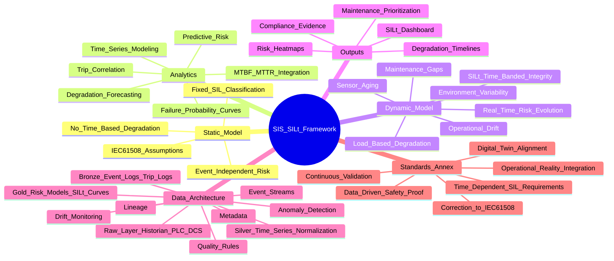

Technical Description (GitHub‑Ready)
The SIS‑Dynamic‑and‑SIL‑t‑Framework is a structured, engineering‑grade methodology for designing, analyzing, and validating Safety Instrumented Systems (SIS) in accordance with IEC 61508 and IEC 61511. The framework provides a unified approach for modeling risk reduction requirements, calculating Safety Integrity Levels (SIL), and evaluating the time‑dependent behavior of safety functions under real operating conditions.

This repository formalizes the complete lifecycle of SIS development, including hazard identification, LOPA‑based risk assessment, SIL determination, architectural constraints, failure probability modeling, and verification of target risk reduction. The framework introduces a dynamic SIL‑t model that incorporates diagnostic coverage, proof‑test intervals, failure modes, common‑cause factors, and demand rate variability to produce a more realistic representation of SIS performance over time.

The methodology supports both low‑demand and high‑demand safety functions and provides a consistent structure for calculating PFDavg, PFH, RRF, and SIL compliance using standardized reliability parameters. It also includes guidance for evaluating sensor‑logic‑final element architectures, redundancy strategies, and failure mitigation mechanisms.

This framework is intended for process safety engineers, reliability engineers, and functional safety practitioners who require a transparent, technically rigorous, and auditable approach to SIS design and SIL verification. It can be used as a reference model for engineering studies, safety lifecycle documentation, competency development, and the creation of organization‑specific SIS standards.
