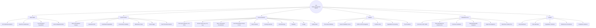

```mermaid
flowchart TB
    A((SIS<br>Safety Instrumented System))

    A --> B1["Static Model"]
    B1 --> B2["IEC 61508 Assumptions"]
    B1 --> B3["Fixed SIL Classification"]
    B1 --> B4["No Time-Based Degradation"]
    B1 --> B5["Event-Independent Risk"]

    A --> C1["Dynamic Model"]
    C1 --> C2["SIL(t) Time-Banded Integrity"]
    C1 --> C3["Operational Drift"]
    C1 --> C4["Load-Based Degradation"]
    C1 --> C5["Environment Variability"]
    C1 --> C6["Maintenance Gaps"]
    C1 --> C7["Sensor Aging"]
    C1 --> C8["Real-Time Risk Evolution"]

    A --> D1["Data Architecture"]
    D1 --> D2["Raw Layer (Historian, PLC, DCS)"]
    D1 --> D3["Bronze: Event Logs, Trip Logs"]
    D1 --> D4["Silver: Time-Series Normalization"]
    D1 --> D5["Gold: Risk Models & SIL(t) Curves"]
    D1 --> D6["Event Streams"]
    D1 --> D7["Anomaly Detection"]
    D1 --> D8["Drift Monitoring"]
    D1 --> D9["Metadata"]
    D1 --> D10["Lineage"]
    D1 --> D11["Quality Rules"]

    A --> E1["Analytics"]
    E1 --> E2["Time-Series Modeling"]
    E1 --> E3["Failure Probability Curves"]
    E1 --> E4["MTBF & MTTR Integration"]
    E1 --> E5["Predictive Risk"]
    E1 --> E6["Degradation Forecasting"]
    E1 --> E7["Trip Correlation"]

    A --> F1["Standards Annex"]
    F1 --> F2["Correction to IEC 61508"]
    F1 --> F3["Time-Dependent SIL Requirements"]
    F1 --> F4["Continuous Validation"]
    F1 --> F5["Operational Reality Integration"]
    F1 --> F6["Digital Twin Alignment"]
    F1 --> F7["Data-Driven Safety Proof"]

    A --> G1["Outputs"]
    G1 --> G2["SIL(t) Dashboard"]
    G1 --> G3["Risk Heatmaps"]
    G1 --> G4["Degradation Timelines"]
    G1 --> G5["Maintenance Prioritization"]
    G1 --> G6["Compliance Evidence"]
```
